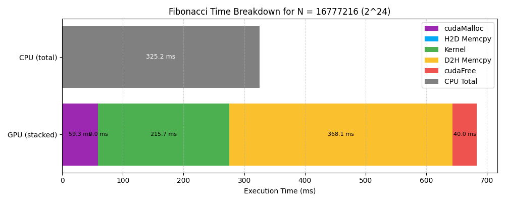
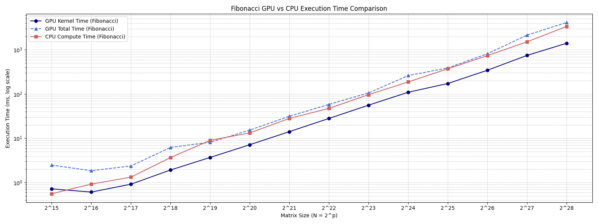

# W04_C14_Fibonacci
Course: HW for AI &amp; ML, Week 4 Challenge 14, Benchmarking Fibonacci sequence in CUDA.

# GPU (CUDA) vs CPU Performance for Fibonacci Sequence Computation

## TL;DR

Even though the **GPU kernel execution is significantly faster than the CPU**, the **total GPU execution time is more than 2x slower** due to massive overhead from **memory transfers and allocations**.

| Metric          | Time (ms)     |
| --------------- | ------------- |
| CPU Total Time  | **325.16 ms** |
| GPU Total Time  | **684.09 ms** |
| GPU Kernel Time | **215.75 ms** |

> **Conclusion:** The GPU spends less than 1/3 of its time doing useful computation. The rest is lost to `cudaMalloc`, `cudaMemcpy`, and `cudaFree`.

---

## 🔧 Experimental Setup

* **Target Computation**: Fibonacci sequence up to $N = 2^{24} = 16,777,216$
* **Platform**: CUDA running on NVIDIA `RTX-3050` 4GB GPU, WSL2 Linux subsystem and Intel `i5-12450H` CPU
* **Comparison**: Sequential CPU vs single-threaded CUDA GPU kernel
* **Metrics recorded**:

  * cudaMalloc Time
  * Kernel Time
  * D2H memcpy Time
  * cudaFree Time
  * Total GPU Time (sum of above)
  * CPU Time (sequential loop)

All times measured using `cudaEvent_t` for GPU and `clock_gettime()` for CPU.

---

## 📊 Full Metrics Breakdown

| Component        | Time (ms)  | Share of GPU Total (%) |
| ---------------- | ---------- | ---------------------- |
| cudaMalloc       | 59.33      | 8.67%                  |
| H2D Memcpy       | 0.00       | 0.00%                  |
| Kernel Execution | 215.75     | 31.53%                 |
| D2H Memcpy       | 368.09     | 53.80%                 |
| cudaFree         | 39.96      | 5.84%                  |
| **GPU Total**    | **684.09** | 100%                   |
| **CPU Total**    | **325.16** |                        |

---

## 🔬 Observations

### ✅ GPU Kernel is Fast

* Computing 16 million Fibonacci numbers in 215 ms is **very fast**, especially with a naïve loop.
* GPU excels at math-heavy tasks when memory isn't a bottleneck.

### ❌ Memory Copy and Setup Dominate

* `cudaMemcpy` from device to host takes **368 ms**, over **half** of total GPU time.
* `cudaMalloc` + `cudaFree` together take \~**100 ms**.
* So even though the kernel is fast, the total time becomes worse than CPU.

### ✅ CPU Loop is Efficient

* The CPU completes the task in \~325 ms.
* Despite being sequential, **data is already local**, no transfer overhead.
* No memory allocation/deallocation costs mid-loop.

---

## 📈 Visualization 1:

* Top bar: **Stacked GPU timing** — shows how much of GPU time is wasted outside the kernel
* Bottom bar: **CPU total time** — a single, tight gray bar
* **Observation**: GPU bar is nearly 2x longer; only a fraction of it is actual compute.

---

## 🧪 Key Lessons

1. **Don’t judge GPU performance by kernel time alone.** Measure total pipeline time.
2. **Memory operations kill performance** when working with massive arrays.
3. For **serial or low-arithmetic tasks**, CPU might outperform GPU.
4. **cudaMemcpy and cudaMalloc** should be reused and minimized if possible.

---

## 📈 Visualization 2:

---

## Key Conclusion

> **GPU kernel is significantly faster than CPU compute time at every scale.**
> But **GPU total time is never faster than CPU**, even at very large N.

---

### Crossover **does not** occur

\| N = 2^28 (268M) | GPU Kernel = **1405 ms** | CPU = **3366 ms** | GPU Total = **4130 ms** |

Even at this massive scale:

* GPU kernel is **2.4× faster** than CPU loop.
* But GPU total time is **\~23% slower** than CPU.

> ***Why?*** Overhead from `cudaMalloc`, `cudaMemcpy`, and `cudaFree` never amortizes enough to make up for it.

---

## 🔍 Component-Level Observations

### 🔹 1. **GPU Kernel is Consistently Excellent**

* Grows roughly linearly with N
* Nearly **2× faster** than CPU at every size
* Example:

  * N = 2^25

    * GPU kernel = **173 ms**
    * CPU = **372 ms**
      → GPU kernel wins hands-down

---

### 🔹 2. **GPU Total Time is Dragged Down by Overhead**

Even though the GPU kernel is fast, the **total time is nearly double CPU time** at most sizes.

| N    | Overhead (Total - Kernel)    | Overhead Share (%)        |
| ---- | ---------------------------- | ------------------------- |
| 2^25 | 388.3 - 172.9 = **215.4 ms** | **55%** of total GPU time |
| 2^28 | 4130 - 1405 = **2725 ms**    | **66%** of total GPU time |

> ❗ **Memory allocation and transfers dominate** total time as size increases.

---

### 🔹 3. **CPU Scales Linearly and Efficiently**

* CPU time is predictable and smooth
* At 2^28: **3366 ms** without any GPU setup overhead

---

### 🔹 4. **No Break-Even Point**

* GPU **never beats CPU** in total time
* Not even at 268M Fibonacci numbers

---

## 🧪 Final Analysis

### ✅ GPU is good for:

* **Pure compute** tasks (e.g., kernel-only performance)
* Situations where overhead can be hidden via **concurrent streams** or **reused memory**

### ❌ GPU is bad for:

* **Sequential problems** (like Fibonacci)
* Workloads where **you copy data for every kernel**
* Small-to-medium size N (because overhead dominates)

---

## 🗂 Files

* `fibonacci_gpu_vs_cpu.cu`: Benchmark source code
* `fibonacci_series_benchmark.cu`: Benchmark source code for series
* `fibonacci_timing.csv`: Output metrics
* `fibonacci_timing_series.csv`: Output metrics for series
* `plot_fibonacci_single.py`: Script for generating the stacked bar plot
* `plot_fibonacci_series.py`: Script for generating the series plot
* `plots/fibonacci_gpu_vs_cpu_bar.png`: Visualization output for stacked bar plot
* `plots/fibonacci_series_kernel_vs_cpu_total.png`: Visualization output for series
* `README.md`: Documentation
---
